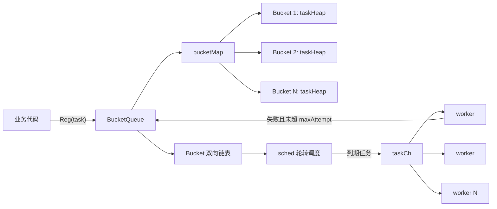

# bucketsched 

`bucketsched` 是一个基于 Go 的内存任务调度队列。它按照 `bucketId` 将任务拆分到不同桶中，在桶之间做轮转调度，在桶内按任务到期时间排序执行，适合需要按用户、租户、业务分片或资源维度做公平消费的异步任务场景。

## 1. 设计目标

- 按 `bucketId` 对任务分组，避免单个业务分片长期占满全部执行资源。
- 支持全局 worker 并发数限制。
- 可选支持单个 bucket 的并发数限制。
- 支持延迟任务，到期后才会被投递给 worker。
- 支持任务失败后的有限次数重试。
- 使用纯内存结构实现，注册任务和调度过程不依赖外部存储。

## 2. 目录结构

```text
bucketsched/
├── go.mod
├── queue.go       # BucketQueue、Bucket、调度循环和 worker 逻辑
├── task.go        # Task、taskHeap 和任务时间排序逻辑
├── queue_test.go  # 队列使用示例测试
└── task_test.go   # taskHeap 行为测试
```

## 3. 核心概念

### 3.1 Task

`Task` 是队列中被调度和执行的最小单元。

主要字段：

| 字段 | 说明 |
| --- | --- |
| `bucketId` | 任务所属 bucket，用于公平调度和 bucket 级并发控制 |
| `taskId` | 自动生成的 UUID |
| `name` | 任务名称，超过 1024 字符会被截断 |
| `hdl` | 任务处理函数，签名为 `func(task *Task) error` |
| `delay` | 初始延迟时间，单位为秒 |
| `delayAt` | 任务可执行时间点 |
| `maxAttempt` | 最大执行次数，失败重试不会超过该次数 |
| `attempted` | 已执行次数 |
| `retryDelay` | 重试延迟，当前没有公开 setter |

公开方法：

```go
func NewTask(bucketId int64, name string, hdl func(task *Task) error, delay uint32, maxAttempt uint32) *Task
func (t *Task) GetAttempted() uint32
func (t *Task) GetTaskId() string
```

### 3.2 Bucket

`Bucket` 表示同一个 `bucketId` 下的一组任务。每个 bucket 内部维护一个 `taskHeap`，按照任务的 `delayAt` 从早到晚出队。

`Bucket` 之间通过双向链表串联，调度器沿链表轮转，实现 bucket 之间的近似公平调度。

### 3.3 BucketQueue

`BucketQueue` 是主要入口，负责：

- 注册任务。
- 管理 bucket 链表和 bucket 索引。
- 启动 worker。
- 执行调度循环。
- 控制全局并发和 bucket 级并发。
- 维护队列长度。

公开方法：

```go
func NewBucketQueue(name string, concurWorkerNum uint32) *BucketQueue
func NewBucketQueueWithBucketConcur(name string, concurWorkerNum, bucketConcurMax uint32) *BucketQueue
func (q *BucketQueue) SetSize(size int)
func (q *BucketQueue) Size() int
func (q *BucketQueue) Reg(task *Task) error
func (q *BucketQueue) Run()
```

## 4. 调度架构



## 5. 调度流程

1. 业务代码通过 `Reg(task)` 注册任务。
2. `BucketQueue` 根据任务的 `bucketId` 找到或创建对应 bucket。
3. 任务进入 bucket 内的 `taskHeap`，按 `delayAt` 排序。
4. `Run()` 启动固定数量 worker，并进入 `sched()` 调度循环。
5. `sched()` 从当前 bucket 尝试弹出一个已经到期的任务。
6. 如果启用了 bucket 并发限制，调度前会检查当前 bucket 正在执行的任务数。
7. 成功弹出任务后，队列长度减一，并通过 `taskCh` 投递给 worker。
8. worker 执行 `task.hdl(task)`。
9. 如果处理函数返回错误，且 `attempted < maxAttempt`，任务会重新注册进队列等待重试。
10. 调度器移动到下一个 bucket，链表到尾部后回到头部。

## 6. 公平性策略

`bucketsched` 的公平性来自 bucket 轮转，而不是单个任务的全局时间排序。

假设有 3 个 bucket：

```text
bucket 1: A1, A2, A3
bucket 2: B1
bucket 3: C1, C2
```

调度器会按 bucket 链表依次尝试：

```text
bucket 1 -> bucket 2 -> bucket 3 -> bucket 1 -> ...
```

每次最多从当前 bucket 取一个到期任务。这样即使 bucket 1 的任务很多，也不会在 bucket 2、bucket 3 有到期任务时长期独占 worker。

注意：bucket 内部仍然按 `delayAt` 排序，因此同一个 bucket 中延迟更短或更早到期的任务会优先执行。

## 7. 并发模型

### 7.1 全局并发

`NewBucketQueue(name, concurWorkerNum)` 中的 `concurWorkerNum` 表示 worker 数量，也是队列的全局最大执行并发。

如果传入 `0`，会自动修正为 `1`。

### 7.2 Bucket 级并发

`NewBucketQueueWithBucketConcur(name, concurWorkerNum, bucketConcurMax)` 可以限制单个 bucket 同时执行的任务数。

例如：

```go
q := bucketsched.NewBucketQueueWithBucketConcur("image-job", 20, 2)
```

含义：

- 队列最多同时运行 20 个 worker。
- 同一个 `bucketId` 下最多同时运行 2 个任务。
- 不同 bucket 可以并发执行。

### 7.3 队列大小

`SetSize(size)` 用于设置最大待调度任务数：

```go
q.SetSize(10000)
```

当队列达到上限时，`Reg` 会返回：

```go
ErrQueueStackFull
```

如果没有调用 `SetSize`，当前实现会使用默认保护阈值，队列长度超过约 2024000 后拒绝继续入队。

`Size()` 返回当前等待调度的任务数量，不包含已经投递给 worker 且正在执行的任务。

## 8. 使用示例

```go
package main

import (
	"errors"
	"fmt"
	"time"

	"github.com/995933447/bucketsched"
)

func main() {
	q := bucketsched.NewBucketQueueWithBucketConcur("demo", 10, 2)
	q.SetSize(10000)

	go q.Run()

	err := q.Reg(bucketsched.NewTask(
		1001,
		"sync-user-profile",
		func(task *bucketsched.Task) error {
			fmt.Println("task id:", task.GetTaskId(), "attempt:", task.GetAttempted())

			if task.GetAttempted() == 1 {
				return errors.New("temporary failure")
			}
			return nil
		},
		3,
		2,
	))
	if err != nil {
		panic(err)
	}

	time.Sleep(10 * time.Second)
}
```

说明：

- 任务属于 bucket `1001`。
- 初始延迟为 3 秒。
- 最多执行 2 次。
- 第一次失败后，如果未超过最大执行次数，会重新入队。

## 9. 错误与重试

worker 执行任务时会先递增 `attempted`，再调用 `hdl`。

```go
task.attempted++
err := task.hdl(task)
```

当 `hdl` 返回 `nil` 时，任务完成。

当 `hdl` 返回错误时：

- 如果 `task.maxAttempt <= task.attempted`，任务停止重试。
- 否则重新计算 `delayAt` 并调用 `Reg(task)` 再次入队。

`maxAttempt` 表示总执行次数，不是额外重试次数。例如 `maxAttempt = 2` 表示最多执行两次：首次执行一次，失败后最多再执行一次。

## 10. 空闲等待与唤醒

调度器在没有 bucket 或所有 bucket 暂无可执行任务时，会调用 `waitNewTaskIn()`。

等待逻辑：

- 最多休眠 1 秒。
- 如果有新任务入队，`Reg` 会尝试向 `newTaskInSign` 发送信号唤醒调度器。

因此调度精度大致为秒级，不适合要求毫秒级准时触发的任务。

## 11. 适用场景

适合：

- 多租户任务队列。
- 按用户、商户、账号、项目等维度公平消费。
- 需要避免单个分片占满全部 worker 的任务系统。
- 简单延迟任务。
- 进程内轻量异步任务调度。

不适合：

- 需要持久化任务的生产队列。
- 需要任务取消、暂停、恢复的调度系统。
- 需要严格毫秒级定时精度的场景。

## 12. 当前实现注意事项

- `Run()` 是阻塞方法，通常需要通过 `go q.Run()` 启动。
- 当前没有公开的停止方法，服务退出需要依赖进程退出或外部生命周期管理。
- `taskCh` 是无缓冲 channel，调度器向 worker 投递任务时会等待空闲 worker。
- `retryDelay` 字段没有公开 setter，外部使用方通常只能通过 `delay` 控制重试延迟。
- `NewTask` 中的 `delayAt` 使用纳秒时间戳；重试逻辑里重新设置 `delayAt` 时使用的是秒级 `Unix()` 时间戳。由于 `taskHeap.popTask()` 使用纳秒时间戳比较，这会导致当前源码下重试任务可能立即变为可执行。建议统一使用 `time.Now().UnixNano() + int64(delay)*int64(time.Second)`。
- `Reg` 在失败重试重新入队失败时目前仅保留 `TODO`，没有日志或补偿逻辑。
- 队列是内存结构，进程重启后未执行任务会丢失。

## 13. 扩展建议

后续可以考虑增加：

- `Stop()` 或基于 `context.Context` 的优雅退出。
- `SetRetryDelay()` 或在 `NewTask` 中暴露重试延迟参数。
- 统一 `delayAt` 时间单位。
- 对重试入队失败增加日志、指标或死信队列。
- 对任务成功、失败、重试、丢弃等事件增加 hook。
- 增加执行耗时、队列长度、bucket 数量、重试次数等指标。
- 增加持久化后端，用于恢复进程重启前未完成的任务。
- 为 `queue_test.go` 增加可自动结束的断言式单元测试，避免长时间 sleep。

